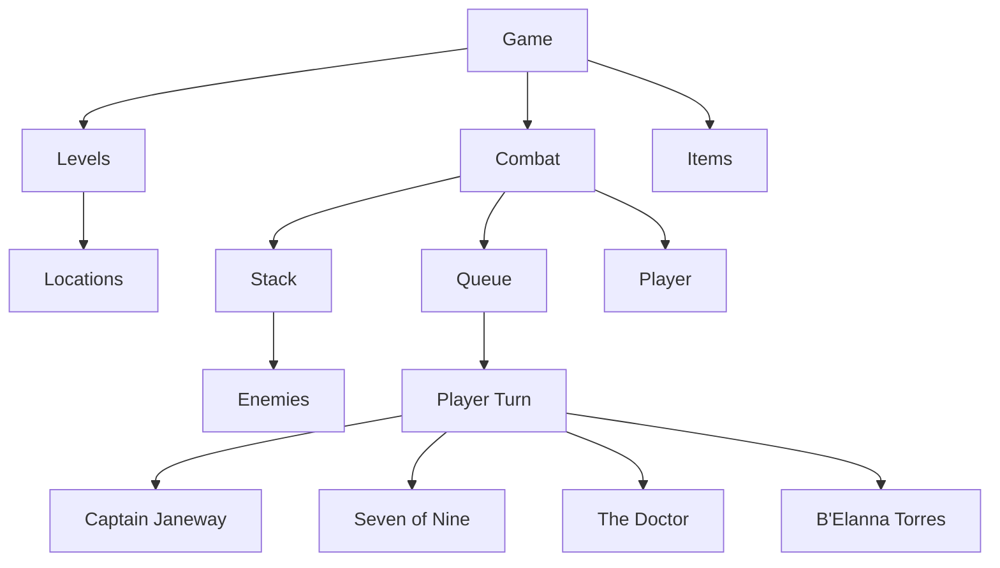

# Software Design Document

**Arturo Menchaca**  
**September 18, 2026**  
**CSCI 202 Data Structures**  
**Professor Venable**

---

## Abstract

*Star Trek: Voyager - Assimilation* is a text-based C++ adventure and combat game. The player guides the Voyager crew through multiple levels as they respond to a Borg invasion. The game combines exploration, player choices, character abilities and turn-based combat. The project demonstrates object-oriented programming through linked lists, stacks and queue data structures.

This Software Design Document provides an overview of the completed game's design, including its overall structure, game flow, behavioral design and major class relationships.

---

## Table of Contents

- [1.0 Introduction](#10-introduction)
  - [1.1 Purpose](#11-purpose)
  - [1.2 Scope](#12-scope)
  - [1.3 Overview](#13-overview)
- [2.0 System Overview](#20-system-overview)
  - [2.1 Game Overview](#21-game-overview)
  - [2.2 Game Flow](#22-game-flow)
  - [2.3 Major Program Components](#23-major-program-components)
- [3.0 Behavioral Design](#30-behavioral-design)
  - [3.1 UML Activity Diagram](#31-uml-activity-diagram)
- [4.0 Class Design](#40-class-design)
  - [4.1 UML Class Diagram](#41-uml-class-diagram)
- [5.0 Summary](#50-summary)
- [Appendix A - Gameplay Design](#appendix-a---gameplay-design)

---

## 1.0 Introduction

### 1.1 Purpose

This Software Design Document describes the design of my CSCI202 midterm project, *Star Trek: Voyager - Assimilation*. It provides an overview of how the C++ text-based game is organized and how its major classes, data structures and game behaviors work together.

### 1.2 Scope

*Star Trek: Voyager - Assimilation* is a text-based adventure and combat game inspired by the TV show *Star Trek: Voyager*. The player guides the Voyager crew through multiple levels while exploring various locations, collecting items and fighting Borg enemies. The project uses object-oriented C++ classes and linked data structures to manage characters, enemies, levels, exploration and turn-based combat.

### 1.3 Overview

This document provides an overview of the program design. Section 2 describes the overall game and its flow. Section 3 presents the behavioral design of the combat system using the UML Activity Diagram. Section 4 presents the class design using the UML Class Diagram and describes the relationships between major classes and data structure. Section 5 summarizes how the design elements work together to support the completed game.

---

## 2.0 System Overview

### 2.1 Game Overview

Inspired by the TV show *Star Trek: Voyager*, the player takes control of the Voyager crew as they respond to a Borg invasion aboard the ship. The game is divided into 5 levels that allow the player to explore 4 locations within each level. Within each level, the player makes decisions, interacts with crew and battles Borg enemies.

The game relies on text-based input and output to present the story, available choices, character information, combat actions and outcomes. The player's decisions during the exploration and combat determine how the game progresses toward its conclusion.

### 2.2 Game Flow

The game begins by introducing the Borg invasion and placing the player in control of the Voyager crew. The player progresses through 5 levels, exploring 4 locations within each level and making choices along the way. Certain locations trigger combat encounters with Borg enemies.

During combat, the player selects attack actions while alternating turns between the Borg and each character of the Voyager crew. Combat continues until the Borg or the Voyager crew are defeated. Successful encounters and complete level exploration allow the player to progress through the remaining levels until reaching the game's final battle with the Borg Queen.

### 2.3 Major Program Components

The game is organized into several classes, with each class handling a specific part of the game's functionality.

| Class | Functionality |
| --- | --- |
| Game | Controls the overall game flow, level progression, exploration, player choices and combat execution. |
| Combat | Controls turn-based combat, including player turns, enemy turns, attacks and damage. |
| Character | Represents the Voyager crew members and provides common character functionality. |
| Borg | Represents the Borg enemies encountered during the game. |
| Level | Represents each stage of the game and its associated locations. |
| Location | Represents individual areas that the player can explore. |
| LinkedList | Stores and organizes the game's Levels. |
| LinkedStack | Manages Borg enemies used during combat. |
| LinkedQueue | Manages the order of character turns during combat. |
| Node | Provides the individual linked elements used to build the data structures. |

The linked-list structures, stack and queue are used as part of the game's combat and organization systems. Together with the game's classes, these components separate story progression, exploration, character management, enemy management and combat execution.

---

## 3.0 Behavioral Design

The behavioral design uses a UML Activity Diagram to illustrate the flow of a combat encounter. It shows how the game moves between player and Borg turns, how attacks are processed and how the game determines whether the combat continues or ends.

### 3.1 UML Activity Diagram

When the player encounters the Borg, the combat feature is triggered, and the game prepares the Voyager crew and Borg enemies for battle.

The player takes a turn by selecting an available action for the current character. The selected action is processed by applying damage and the game checks whether the Borg enemy has been defeated.

If the enemy has not been defeated, combat continues with the next turn. Borg enemies take their turns by attacking a Voyager crew member, after which the game checks whether the character has been defeated. Characters that have not been defeated remain in the queue rotation.

Combat continues until all Borg enemies have been defeated or the Voyager crew has been defeated. The result of the combat determines whether the player can progress through the game or reaches a game-over condition, which concludes the gameplay.

---

## 4.0 Class Design

The class design describes classes and data structures used to organize the game. The classes separate requirements such as game progression, character management, exploration and combat. The linked-list structures, stacks and queues organize and access game objects within the game.

### 4.1 UML Class Diagram

The UML Class Diagram illustrates the relationship between the classes and data structures. They are connected according to what they perform within the game.

- The **Game** class manages the overall progression and interacts with the level, location and combat systems.
- **Combat** works with the character and Borg classes while using LinkedStack and LinkedQueue to manage combat.
- **LinkedList** organizes the levels and their associated locations.

---

## 5.0 Summary

*Star Trek: Voyager - Assimilation* uses classes, linked lists, stacks and queues to support text-based exploration and combat gameplay. The Game class manages the overall game progression, while the supporting classes handle characters, Borg enemies, levels, locations and combat. Linked lists organize levels and their locations, stacks manage enemy characters and queues rotate player character turns during combat.

The combat Activity Diagram provides a visual representation of the game's combat behavior, while the Class Diagram shows the major classes and their relationships. Together, these designs provide an overview of how the completed program is organized and operates to provide a text-based gaming experience for users.

---

## Appendix A - Gameplay Design

**Star Trek: Voyager - Assimilation**

### Game Premise

The USS Voyager has been attacked by the Borg! Borg drones have boarded the ship and begun assimilating crew members and systems.

Captain Janeway and Seven of Nine must make their way through Voyager to reach Main Engineering, where B'Elanna Torres has developed a way to modify Voyager's phasers so they can bypass Borg adaptation.

The Doctor possesses the nanoprobes necessary to complete the weapon's modification.

Once the modified phasers are created, the team must reach Cargo Bay 2, where the Borg Queen has established a temporary control center.

**Objective:** Defeat the Borg Queen and disable the Borg Collective's ability to adapt to Voyager's weapons.

### Player Party

| Player | Role | Abilities |
| --- | --- | --- |
| Captain Kathryn Janeway | Captain | Phaser Attack; Tactical Command |
| Seven of Nine | Astrometrics Specialist | Phaser Attack; Borg Knowledge |
| The Doctor | Chief Medical Officer / Emergency Medical Hologram | Advanced Healer; Federation Database Knowledge |
| B'Elanna Torres | Chief Engineer | Phaser Attack; Weapons Engineering |

The player controls a team, rather than a single character. The Doctor joins the team as the game progresses.

### Game Progression

| Level | Locations | Story / Objective | Events / Encounters | Game Progress |
| --- | --- | --- | --- | --- |
| 1 - The Bridge | Main Bridge; Captain's Ready Room; Turbolift Junction; Bridge Corridor | Janeway and Seven respond to the Borg invasion and must find a route into Voyager's interior. | The Borg breach the Main Bridge! Look for a way out! Combat: 2 Borg Drones | Explore all four locations and defeat the Borg. |
| 2 - Jeffries Tubes | Jeffries Tube Access; Maintenance Junction; Power Relay Section; Damaged Jeffries Tube | Janeway and Seven use Voyager's maintenance network to bypass Drone infested areas and reach Medical Bay. | There's a power failure! Find Emergency Power Cells to power up the access relay. Combat: 2 Borg Drones | Explore all four locations and defeat the Borg. |
| 3 - Medical Bay | Sickbay Entrance; Medical Lab; Emergency Ward; Sickbay | The team finds the Doctor and acquire the nanoprobes needed to develop a weapon against the Borg. | The Doctor has been deactivated! Use emergency power cells to activate the Doctor and collect the Nanoprobes. Combat: 2 Borg Drones | Explore all four locations, defeat the Borg and recruit the Doctor. |
| 4 - Main Engineering | Engineering Corridor; Secondary Systems; Warp Core Control; Main Engineering | The team head to Engineering, where B'Elanna develops the modified phaser technology. | B'Elanna is trapped battling Drones! Create a temporary force field around the warp core to build the phasers. Combat: 2 Borg Drones | Explore all four locations, construct Modified Transphasic Phasers and defeat the Borg. |
| 5 - Cargo Bay 2 | Cargo Corridor; Cargo Storage; Borg Control Area; Borg Queen's Chamber | The team reaches the Borg's control center and confronts the Borg Queen! | The Queen's Lair! Combat: 4 Borg Drones; Final Combat: Borg Queen | Explore all four locations and defeat the Borg Queen using the modified phaser. |

### Level Design

| Level | Setting | Locations |
| --- | --- | --- |
| 1 - The Bridge | USS Voyager's Bridge and surrounding corridors | Main Bridge → Captain's Ready Room → Turbolift Junction → Bridge Corridor |
| 2 - Jeffries Tubes | Voyager's maintenance network known as Jeffries Tubes | Jeffries Tube Access → Maintenance Junction → Power Relay Section → Damaged Jeffries Tube |
| 3 - Medical Bay | Voyager's Sickbay and medical rooms | Sickbay Entrance → Medical Lab → Emergency Ward → Sickbay |
| 4 - Main Engineering | Voyager's Engineering section | Engineering Corridor → Secondary Systems → Warp Core Control → Main Engineering |
| 5 - Cargo Bay 2 | Borg-controlled Cargo Bay 2 | Cargo Corridor → Cargo Storage → Borg Control Area → Borg Queen's Chamber |

### Basic Player Commands

| Command | Function |
| --- | --- |
| Explore | Discover available items and encounters. |
| Continue | Move to the next section of the game. |
| Check Party | Explore team member status. |
| Check Inventory | View existing items. |
| Attack | Perform an attack against an enemy. |
| Special Ability | Deploy team member's secondary ability. |

### Items

| Item | Purpose |
| --- | --- |
| Phaser | Standard Voyager weapons used to attack Borg enemies. |
| Emergency Power Cell | Restores ship's power. |
| Borg Nanoprobes | Obtained from the Doctor and used to develop a weapon capable of bypassing Borg adaptation. |
| Modified Transphasic Phaser | Upgraded Phaser created in Main Engineering using Voyager phaser technology and Borg nanoprobes; required to defeat the Borg Queen. |

### Combat Enemies

| Enemy | Role | Description |
| --- | --- | --- |
| Borg Drone | Standard Enemy | Individual members of the Borg Collective encountered throughout the game. |
| Borg Queen | Final Boss | Leader of the Borg Collective. Controls all Borgs through a neuro-network. |

### Data Structure

| Data Structure | Management | Description |
| --- | --- | --- |
| Linked List | Levels | Level Sequence |
| Stack | Enemies | Combat encounter (LIFO) |
| Queue | Combat Turns | Player turn (FIFO) |

### Modular Architecture

### Modular Design

| Game Objects | Linked List | Stack | Queue |
| --- | --- | --- | --- |
| | Levels | Enemies | Player Turn |
| 1 | Level 1 | Borg 1 | Captain Janeway |
| 2 | Level 2 | Borg 2 | Seven of Nine |
| 3 | Level 3 | Borg Queen | The Doctor |
| 4 | Level 4 | | B'Elanna Torres |
| 5 | Level 5 | | |
